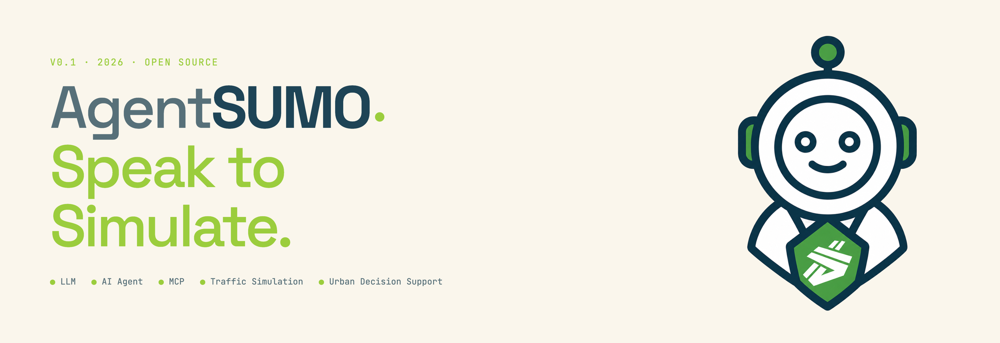
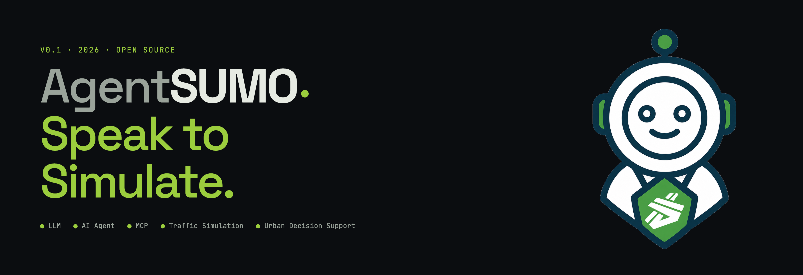
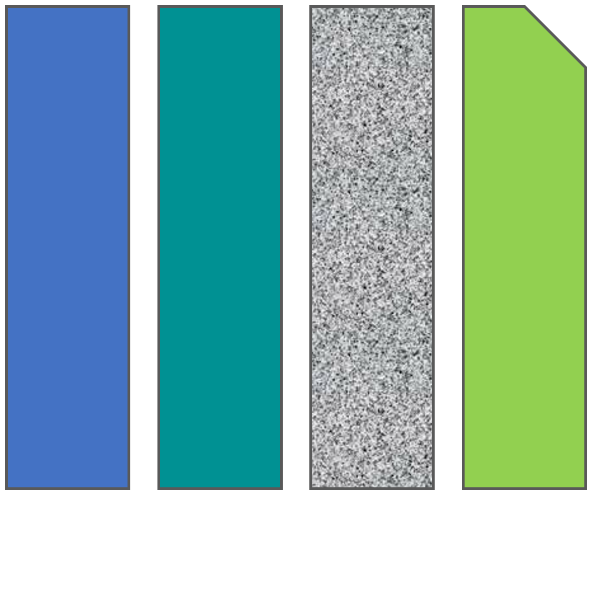

```{raw} html
<div class="hero-header">
  
  
</div>
```

# AgentSUMO Documentation

> An Agentic Framework for Interactive Simulation Scenario Generation in SUMO via Large Language Models

Welcome to the official documentation for **AgentSUMO**.

## What is AgentSUMO

Urban stakeholders such as planners, policymakers, and city officials need
evidence-based traffic-simulation tools, but SUMO's XML-based workflow has
historically required domain expertise. AgentSUMO bridges that gap by
organizing simulation into three layers: a **reasoning layer** with the
**Planner Agent** and its **Interactive Planning Protocol** that translates
underspecified policy objectives into validated simulation plans through
dialogue; an **execution layer** built on the **AgentSUMO MCP Server**
(26 tools across scenario generation, policy experimentation, result
analysis, visualization, and utilities) alongside Anthropic's Filesystem
and SQLite MCP servers; and an **interaction layer** delivering a web-based
interface for geospatial visualization, simulation replay, and
database-driven analysis across scenarios.

```{figure} _static/CEUS_fig5_system_architecture.png
:alt: Software architecture of the AgentSUMO web interface
:width: 100%
:align: center

Software architecture of the web interface. The frontend (file explorer,
geospatial visualizer, chat panel) communicates with the FastAPI backend
over a REST API for static-file serving and data retrieval and a WebSocket
channel for real-time chat and tool-execution progress. The backend
invokes the Planner Agent asynchronously, which drives the MCP tool layer
and the SUMO engine to generate GeoJSON, replay JSON, and HTML reports
served back to the frontend.
```

## Key features

- **Goal-oriented, human-in-the-loop scenario construction** through the
  Interactive Planning Protocol (task complexity assessment → parameter
  sufficiency validation → clarify-before-execute).
- **Unified MCP tool layer** covering scenario generation, policy
  experimentation, result analysis, and visualization, all introspectable
  and reusable.
- **Database-driven result analysis**: SUMO XML outputs are parsed into a
  structured SQLite schema queryable in natural language via the SQLite MCP
  server, enabling cross-scenario comparison without leaving the chat.

## Who is this for

- **Urban planners and policymakers** evaluating infrastructure, signal, or
  fleet-composition interventions without writing XML by hand.
- **Transportation researchers** running large batches of scenario
  comparisons.
- **Developers** extending SUMO with LLM-driven workflows or integrating new
  MCP tools.

## Documentation overview

::::{grid} 1 2 2 4
:gutter: 3

:::{grid-item-card} Installation
:link: installation
:link-type: doc

Install SUMO, configure your API key, and prepare your environment.
:::

:::{grid-item-card} Tutorials
:link: tutorials/index
:link-type: doc

Reproduce the paper case studies and tour the web interface.
:::

:::{grid-item-card} Tools
:link: mcp_servers/index
:link-type: doc

Reference for the 26 AgentSUMO MCP tools and the two upstream MCP servers.
:::

:::{grid-item-card} Schema
:link: database/index
:link-type: doc

ER diagram, column tables, and example queries for `simulations.db`.
:::

::::

## Citation

AgentSUMO is described in:

> **AgentSUMO: An Agentic Framework for Interactive Simulation Scenario
> Generation in SUMO via Large Language Models.**
> Minwoo Jeong, Jeeyun Chang, Yoonjin Yoon.
> arXiv preprint [arXiv:2511.06804](https://arxiv.org/abs/2511.06804),
> 2025.

If you use AgentSUMO in your research, please cite the paper:

```bibtex
@article{jeong2025agentsumo,
  title={AgentSUMO: An Agentic Framework for Interactive Simulation Scenario Generation in SUMO via Large Language Models},
  author={Jeong, Minwoo and Chang, Jeeyun and Yoon, Yoonjin},
  journal={arXiv preprint arXiv:2511.06804},
  year={2025}
}
```

## Authors

```{raw} html
<ul class="author-list">
  <li>
    <strong>Minwoo Jeong</strong>, Graduate School of Data Science, KAIST
  </li>
  <li>
    <strong>Jeeyun Chang</strong>, Graduate School of Data Science, KAIST
  </li>
  <li>
    <strong>Yoonjin Yoon</strong> (corresponding author),
    Department of Civil and Environmental Engineering ·
    Graduate School of AI ·
    Graduate School of Data Science, KAIST
  </li>
</ul>

<div class="institution-logos">
  <a href="https://www.kaist.ac.kr/en/" target="_blank" rel="noopener" class="institution-logo">
    
  </a>
  <a href="https://caus.kaist.ac.kr/" target="_blank" rel="noopener" class="institution-logo">
    
    
  </a>
  <a href="https://spacetime.kaist.ac.kr/" target="_blank" rel="noopener" class="institution-logo">
    
  </a>
</div>
```

## License

AgentSUMO is released under the **MIT License**. See the
[LICENSE](https://github.com/mw-jeong/AgentSUMO/blob/main/LICENSE) file in the
repository for the full text.

```{toctree}
:hidden:
:maxdepth: 2

installation
tutorials/index
mcp_servers/index
database/index
```
